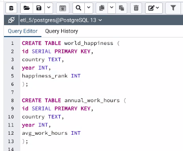

# ETL Project

## Team 5: Emerson Williams-Molett, Kerry Harp, Yonis Hassan

This project demonstrates the ability to extract, transform, and load (ETL) data for use in data analysis.

Clone the repository to your desktop and do the following:

1. Navigate to the cloned folder and launch a GitBash (Windows) or Terminal (Mac).

1. Type `source activate PythonData` and hit ENTER.

1. Launch __Jupyter Notebook__ and open the file, [etl_project.ipynb](etl_project.ipynb). This file is both the Python code and the required Technical Report.

1. Observe the *Data Extraction* section that shows the 2 CSV files were successfully imported.

1. Observe the *Data Cleanup* section which shows the data cleanup by removing unwanted columns, renaming columns, and deleting unwanted rows. This results in 2 cleaned dataframes.

1. In the Jupyter Notebook file, create the database connection by inserting username and password into this this code: `conn = "<insert user name>:<insert password>@localhost:5432/etl_5"`. Verify that the connection was made showing two tables. 

1. Launch and use __pgAdmin4__ to open the file, [queries.sql](queries.sql) to perform the queries on the tables, *world_happiness* and *annual_work_hours* . 

